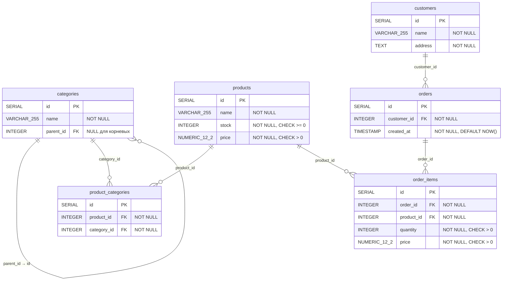

# Система управления заказами

Тестовое приложение, включающее проектирование реляционной схемы БД, набор SQL-запросов для аналитики и REST-API сервис на Python для добавления товаров в заказы. Система охватывает управление номенклатурой с иерархическим каталогом категорий неограниченной вложенности, клиентами и заказами покупателей.

## Стек технологий

| Компонент | Технология |
|-----------|------------|
| Web-фреймворк | FastAPI + Uvicorn |
| ORM | SQLAlchemy 2.0 (async) |
| Миграции | Alembic |
| СУБД | PostgreSQL 16 |
| Оркестрация | Docker Compose |
| Валидация | Pydantic v2 |

## Запуск

```bash
# Запуск всех сервисов (PostgreSQL → Alembic миграции → API)
docker compose up -d

# Проверка статуса
docker compose ps

# API доступен по адресу
http://localhost:8000

# Остановка и удаление контейнеров
docker compose down
```

Docker Compose поднимает три сервиса:
1. **db** — PostgreSQL 16 (Alpine), порт 5432
2. **alembic** — одноразовый контейнер, применяет миграции (`alembic upgrade head`) и завершается
3. **api** — FastAPI-приложение, порт 8000; стартует после успешного завершения миграций

> **Примечание:** файл `.env` с переменными окружения (логин/пароль БД) включён в репозиторий для удобства запуска тестового проекта. В production-окружении `.env` не должен храниться в репозитории — используйте секреты CI/CD, Vault или переменные окружения хоста.

## Даталогическая схема данных

### ER-диаграмма



### Описание таблиц

#### categories — Категории номенклатуры

| Поле | Тип | Ограничения |
|------|-----|-------------|
| id | SERIAL | PRIMARY KEY |
| name | VARCHAR(255) | NOT NULL |
| parent_id | INTEGER | REFERENCES categories(id) ON DELETE CASCADE, NULLABLE |

- Иерархическое дерево категорий неограниченной вложенности (Adjacency List)
- `parent_id = NULL` — корневая категория
- Каскадное удаление дочерних категорий при удалении родительской
- Индекс: `idx_categories_parent_id` на `parent_id`

#### products — Номенклатура

| Поле | Тип | Ограничения |
|------|-----|-------------|
| id | SERIAL | PRIMARY KEY |
| name | VARCHAR(255) | NOT NULL |
| stock | INTEGER | NOT NULL, CHECK (stock >= 0) |
| price | NUMERIC(12,2) | NOT NULL, CHECK (price > 0) |

#### product_categories — Связь товаров и категорий (many-to-many)

| Поле | Тип | Ограничения |
|------|-----|-------------|
| id | SERIAL | PRIMARY KEY |
| product_id | INTEGER | NOT NULL, REFERENCES products(id) |
| category_id | INTEGER | NOT NULL, REFERENCES categories(id) |

- UNIQUE(product_id, category_id)
- Бизнес-правило: все категории одного товара принадлежат одной корневой ветке дерева (проверяется на уровне приложения)

#### customers — Клиенты

| Поле | Тип | Ограничения |
|------|-----|-------------|
| id | SERIAL | PRIMARY KEY |
| name | VARCHAR(255) | NOT NULL |
| address | TEXT | NOT NULL |

#### orders — Заказы

| Поле | Тип | Ограничения |
|------|-----|-------------|
| id | SERIAL | PRIMARY KEY |
| customer_id | INTEGER | NOT NULL, REFERENCES customers(id) |
| created_at | TIMESTAMP | NOT NULL, DEFAULT NOW() |

- Индексы: `idx_orders_customer_id`, `idx_orders_created_at`

#### order_items — Позиции заказа

| Поле | Тип | Ограничения |
|------|-----|-------------|
| id | SERIAL | PRIMARY KEY |
| order_id | INTEGER | NOT NULL, REFERENCES orders(id) ON DELETE CASCADE |
| product_id | INTEGER | NOT NULL, REFERENCES products(id) |
| quantity | INTEGER | NOT NULL, CHECK (quantity > 0) |
| price | NUMERIC(12,2) | NOT NULL, CHECK (price > 0) |

- UNIQUE(order_id, product_id) — один товар в заказе не дублируется
- Цена фиксируется на момент добавления в заказ
- Каскадное удаление при удалении заказа
- Индексы: `idx_order_items_order_id`, `idx_order_items_product_id`


## API

### POST /api/orders/items — Добавление товара в заказ

Добавляет товар в существующий заказ. Если товар уже есть в заказе — увеличивает количество (upsert). Списывает количество со склада. Использует `SELECT ... FOR UPDATE` для защиты от race condition.

#### Запрос

```
POST /api/orders/items
Content-Type: application/json
```

```json
{
  "order_id": 1,
  "product_id": 1,
  "quantity": 3
}
```

| Параметр | Тип | Описание |
|----------|-----|----------|
| order_id (body) | int | Идентификатор заказа |
| product_id (body) | int | Идентификатор товара |
| quantity (body) | int | Количество (> 0) |

#### Ответы

**201 Created** — новая позиция добавлена:

```json
{
  "order_id": 1,
  "product_id": 1,
  "quantity": 3,
  "message": "Позиция добавлена"
}
```

**200 OK** — количество существующей позиции увеличено:

```json
{
  "order_id": 1,
  "product_id": 1,
  "quantity": 5,
  "message": "Позиция обновлена"
}
```

**400 Bad Request** — недостаточно товара на складе:

```json
{
  "detail": "Недостаточно товара на складе. Доступно: 2, запрошено: 10"
}
```

**404 Not Found** — заказ или товар не найден:

```json
{
  "detail": "Заказ с id=999 не найден"
}
```

```json
{
  "detail": "Товар с id=999 не найден"
}
```

**422 Unprocessable Entity** — невалидные входные данные (например, quantity ≤ 0):

Стандартная ошибка валидации Pydantic.

## SQL-запросы

### 2.1 Сумма товаров по клиентам

Запрос возвращает наименование клиента и общую сумму заказанных товаров. Сумма вычисляется как `SUM(quantity × price)` по всем позициям всех заказов клиента. Используется `oi.price` (цена, зафиксированная на момент добавления в заказ), а не `p.price` (текущая цена товара), чтобы отражать реальную стоимость покупок.

```sql
SELECT
    c.name AS customer_name,
    SUM(oi.quantity * oi.price) AS total_amount
FROM customers c
JOIN orders o ON o.customer_id = c.id
JOIN order_items oi ON oi.order_id = o.id
GROUP BY c.id, c.name
ORDER BY total_amount DESC;
```

Пример результата:

| customer_name | total_amount |
|---------------|-------------|
| ООО «Альфа» | 150000.00 |
| ИП Иванов | 87500.50 |
| ООО «Бета» | 42300.00 |

### 2.2 Количество дочерних категорий первого уровня

Запрос возвращает для каждой категории количество её непосредственных дочерних категорий (первый уровень вложенности). `LEFT JOIN` гарантирует, что листовые категории (без дочерних элементов) также включены в результат со значением `children_count = 0`.

```sql
SELECT
    c.id,
    c.name,
    COUNT(child.id) AS children_count
FROM categories c
LEFT JOIN categories child ON child.parent_id = c.id
GROUP BY c.id, c.name
ORDER BY c.id;
```

Пример результата:

| id | name | children_count |
|----|------|---------------|
| 1 | Электроника | 3 |
| 2 | Смартфоны | 0 |
| 3 | Ноутбуки | 0 |
| 4 | Аксессуары | 2 |
| 5 | Чехлы | 0 |
| 6 | Зарядки | 0 |

### 2.3.1 VIEW «Топ-5 товаров за последний месяц»

Представление возвращает пять товаров с наибольшим суммарным количеством проданных штук за последний календарный месяц. Рекурсивный CTE (`category_root`) поднимается по дереву категорий от категории товара до корневой категории (`parent_id IS NULL`), чтобы определить категорию первого уровня для каждого товара.

```sql
CREATE OR REPLACE VIEW top5_products_last_month AS
WITH RECURSIVE category_root AS (
    -- Базовый случай: категории, привязанные к товарам
    SELECT pc.product_id, cat.id AS category_id, cat.parent_id
    FROM product_categories pc
    JOIN categories cat ON cat.id = pc.category_id

    UNION ALL

    -- Рекурсивный шаг: поднимаемся к корню
    SELECT cr.product_id, parent.id AS category_id, parent.parent_id
    FROM category_root cr
    JOIN categories parent ON parent.id = cr.parent_id
    WHERE cr.parent_id IS NOT NULL
)
SELECT
    p.name AS product_name,
    root_cat.name AS root_category_name,
    SUM(oi.quantity) AS total_sold
FROM order_items oi
JOIN orders o ON o.id = oi.order_id
JOIN products p ON p.id = oi.product_id
LEFT JOIN (
    SELECT DISTINCT product_id, category_id
    FROM category_root
    WHERE parent_id IS NULL
) pr ON pr.product_id = p.id
LEFT JOIN categories root_cat ON root_cat.id = pr.category_id
WHERE o.created_at >= date_trunc('month', CURRENT_DATE) - INTERVAL '1 month'
  AND o.created_at < date_trunc('month', CURRENT_DATE)
GROUP BY p.id, p.name, root_cat.name
ORDER BY total_sold DESC
LIMIT 5;
```

Пример результата:

| product_name | root_category_name | total_sold |
|-------------|-------------------|-----------|
| iPhone 15 | Электроника | 320 |
| Galaxy S24 | Электроника | 275 |
| MacBook Air | Электроника | 150 |
| Кроссовки Nike | Одежда и обувь | 130 |
| Наушники AirPods | Электроника | 95 |


## Анализ и оптимизация (пункт 2.3.2)

Рекомендации по оптимизации запроса «Топ-5» и общей схемы данных при росте нагрузки до тысяч заказов в день.

### Индексы

1. **`idx_orders_created_at`** на `orders(created_at)` — ускоряет фильтрацию заказов за последний месяц в VIEW «Топ-5». Уже создан в текущей схеме.

2. **`idx_order_items_product_id`** на `order_items(product_id)` — ускоряет JOIN и агрегацию по товарам. Уже создан в текущей схеме.

3. **`idx_categories_parent_id`** на `categories(parent_id)` — ускоряет рекурсивные CTE и запрос дочерних элементов. Уже создан в текущей схеме.

4. **Составной индекс на `order_items(product_id, quantity)`** — покрывающий индекс для агрегации количества по товарам без обращения к основной таблице (Index-Only Scan).

### Материализованное представление (MATERIALIZED VIEW)

При тысячах заказов в день рекурсивный CTE в VIEW становится дорогим. Замена обычного VIEW на `MATERIALIZED VIEW` с периодическим обновлением снижает нагрузку на чтение:

```sql
CREATE MATERIALIZED VIEW top5_products_last_month_mat AS
  -- ... тот же запрос ...
;

-- Обновление (например, по cron раз в час)
REFRESH MATERIALIZED VIEW CONCURRENTLY top5_products_last_month_mat;
```

`CONCURRENTLY` позволяет обновлять представление без блокировки чтения.

### Денормализация root_category_id

Добавление предвычисленного поля `root_category_id` в таблицу `product_categories` устраняет необходимость рекурсивного CTE при каждом запросе. Поле обновляется триггером при изменении иерархии категорий. Это значительно ускоряет запрос «Топ-5», так как вместо рекурсивного обхода дерева используется прямой JOIN.

### Партиционирование orders по created_at

При значительном росте данных — помесячное партиционирование таблицы `orders` по полю `created_at`:

```sql
CREATE TABLE orders (
    id SERIAL,
    customer_id INTEGER NOT NULL,
    created_at TIMESTAMP NOT NULL DEFAULT NOW()
) PARTITION BY RANGE (created_at);

CREATE TABLE orders_2025_01 PARTITION OF orders
    FOR VALUES FROM ('2025-01-01') TO ('2025-02-01');
```

PostgreSQL автоматически сканирует только нужную партицию при фильтрации по дате, что ускоряет запросы и упрощает архивирование старых данных.

### Кэширование в Redis

Хранение результата «Топ-5» в Redis с пересчётом по cron (например, раз в час). Полностью снимает нагрузку с БД для частых чтений этого отчёта. Подходит для дашбордов и API, где допустима задержка данных в пределах часа.

### Event-driven архитектура (RabbitMQ / Kafka)

При масштабировании — вынести обработку заказов в асинхронную очередь через RabbitMQ или Kafka. Позволяет:
- Развязать API и тяжёлую бизнес-логику
- Обеспечить CQRS-подход (разделение чтения и записи)
- Горизонтально масштабировать обработчики заказов
- Гарантировать обработку при пиковых нагрузках через буферизацию сообщений

## Структура проекта

```
order-management-system/
├── docker-compose.yml          # Оркестрация: PostgreSQL + Alembic + API
├── Dockerfile                  # Образ для API-сервиса
├── .gitignore
├── README.md
├── requirements.txt            # Python-зависимости
├── alembic.ini                 # Конфигурация Alembic
├── alembic/
│   ├── env.py                  # Настройка окружения миграций
│   ├── script.py.mako          # Шаблон миграций
│   └── versions/
│       └── 001_initial_schema.py  # Начальная миграция (все таблицы)
├── app/
│   ├── __init__.py
│   ├── main.py                 # Точка входа FastAPI
│   ├── config.py               # Настройки (DATABASE_URL)
│   ├── database.py             # Async engine, SessionLocal, Base
│   ├── models.py               # ORM-модели (6 таблиц)
│   ├── schemas.py              # Pydantic-схемы (AddItemRequest, AddItemResponse)
│   ├── routers/
│   │   ├── __init__.py
│   │   └── orders.py           # POST /api/orders/items
│   └── services/
│       ├── __init__.py
│       └── order_service.py    # Бизнес-логика добавления товара в заказ
└── sql/
    ├── customer_totals.sql     # Сумма товаров по клиентам
    ├── category_children.sql   # Количество дочерних категорий
    └── top5_products_view.sql  # VIEW «Топ-5 товаров за месяц»
```
